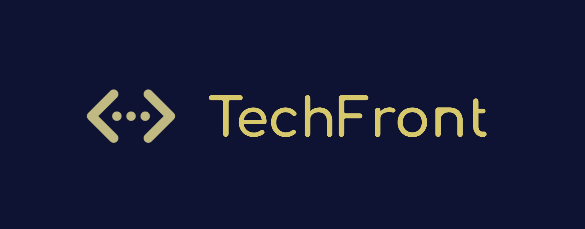

Приложение TechFront полезный инструмент для подготовки к техническим интервью и улучшения навыков фронтенд-разработки. Помогает пользователям уверенно пройти интервью и создает ценную базу знаний и навыков, которые можно будет использовать в будущем.

### Основные функции приложения

1. **Создание профиля пользователя**:

   - Регистрация и авторизация пользователей.
   - Ведение профиля с информацией о навыках и опыте.
   - Возможность добавления личных заметок и целей.

2. **Система вопросов и задач**:

   - База данных с вопросами и задачами по фронтенд-разработке.
   - Классификация вопросов по темам: HTML, CSS, JavaScript, React, архитектура приложений, алгоритмы и структуры данных и т.д.
   - Поддержка разных уровней сложности: начальный, средний, продвинутый.

3. **Интерактивные упражнения и задачи**:

   - Возможность решения задач прямо в браузере с проверкой и подсказками.
   - Режим тренировки с возможностью получения подсказок и решений.
   - Таймер для отслеживания времени, затраченного на решение задач.

4. **Модульные и комплексные тесты**:

   - Создание модульных тестов по конкретным темам.
   - Комплексные тесты, имитирующие реальные интервью.
   - Возможность отслеживания прогресса и результатов тестов.

5. **Система обратной связи и оценок**:

   - Оценка решений задач и тестов.
   - Возможность получения обратной связи от других пользователей или экспертов.
   - Поддержка комментариев и обсуждений для каждой задачи.

6. **Видео-интервью и практические задания**:

   - Поддержка видео-интервью с автоматической записью и анализом.
   - Практические задания на разработку мини-проектов.
   - Оценка выполненных проектов с возможностью получения рекомендаций.

7. **Рекомендации по подготовке и обучающие материалы**:

   - Список рекомендованных ресурсов для изучения.
   - Подборка обучающих видео, статей и книг.
   - Персонализированные рекомендации на основе прогресса пользователя.

8. **Форум и сообщество**:

   - Встроенный форум для обсуждения вопросов и обмена опытом.
   - Возможность создания групп и участия в сообществах по интересам.
   - Система вопросов и ответов для взаимодействия с экспертами.

9. **Геймификация и мотивация**:

   - Система наград и достижений для мотивации пользователей.
   - Лидеры и таблицы результатов.
   - Ежедневные и еженедельные челленджи.

### Примерная структура приложения

1. **Регистрация и вход**:

   - Страницы для регистрации и авторизации.
   - Форма создания и редактирования профиля.

2. **Главная страница**:

   - Обзор текущих задач и прогресса.
   - Быстрый доступ к тестам и упражнениям.

3. **Страница вопросов и задач**:

   - Категории и фильтры для поиска вопросов.
   - Интерфейс для решения задач с подсказками и проверкой.

4. **Страница тестов**:

   - Список доступных тестов и их описание.
   - Интерфейс для прохождения тестов с таймером.

5. **Страница результатов**:

   - Отображение результатов тестов и задач.
   - Графики и таблицы для визуализации прогресса.

6. **Форум и сообщество**:

   - Интерфейс для общения и обсуждения.
   - Система вопросов и ответов.

7. **Рекомендации и ресурсы**:

   - Список рекомендованных материалов и ресурсов.
   - Персонализированные рекомендации.

### Используемые технологии

- **Frontend:**

- React — Библиотека для создания пользовательских интерфейсов.
- TypeScript — Язык программирования с поддержкой типов.
- Redux — Менеджер состояния для JavaScript-приложений.
- Material-UI — Набор компонентов для создания адаптивных интерфейсов.
- Webpack — Инструмент для сборки и оптимизации кода.

- **Backend:**

  NestJS: Фреймворк для создания серверных приложений на Node.js с поддержкой TypeScript.
  MongoDB: Документо-ориентированная база данных для хранения данных пользователей и задач.
